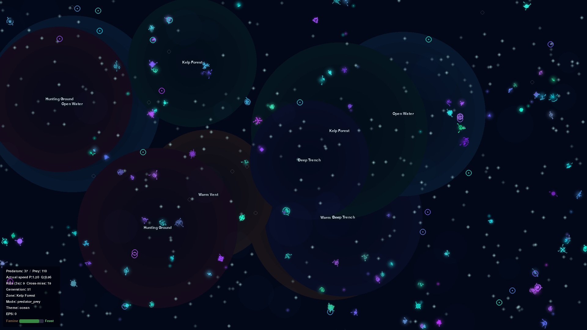
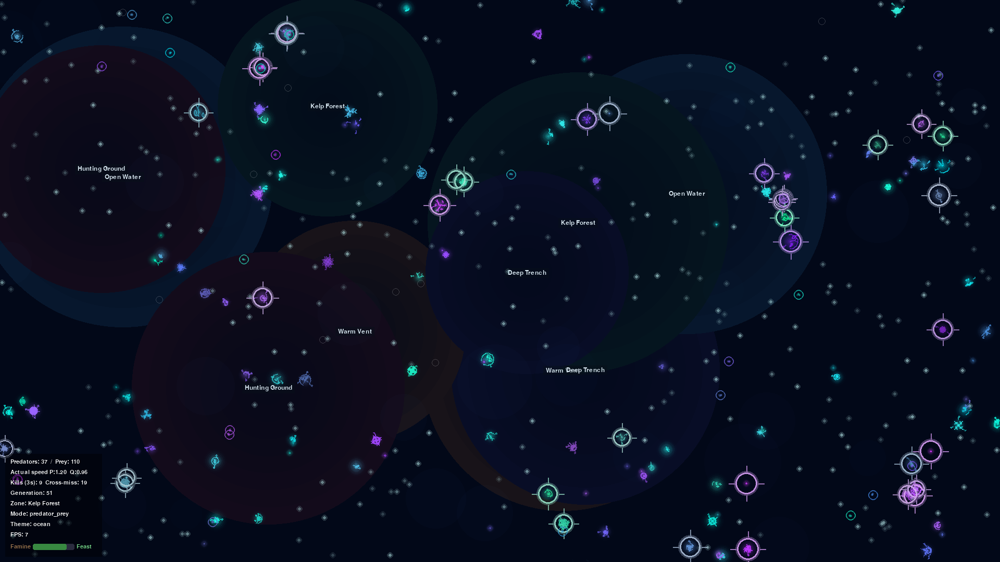
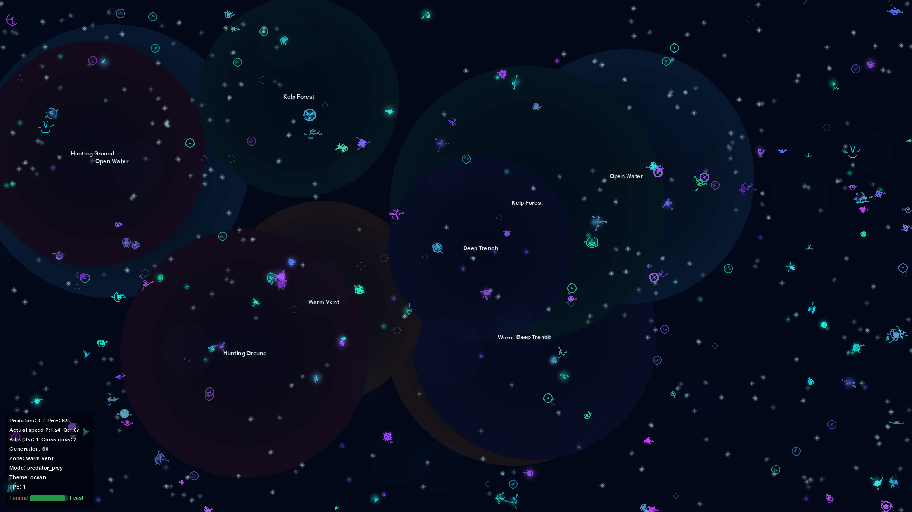

# Primordial — Predator/Prey System Guide

A design and behavior document for the current simulation, with primary focus on **predator_prey** mode. Written for a human designer trying to understand what exists, how the world behaves, what evolutionary mechanisms are present, what the user can perceive, and where the design is strong, subtle, or unclear.

**Source of truth:** the codebase as of commit `fe6c3fb` (main branch, post-regression reversion).

---

## 1. What the simulation is

Primordial is a fullscreen screensaver that runs a continuous evolutionary simulation. Glowing symbolic creatures live, eat, reproduce, mutate, and die in an endless loop against a dark bioluminescent ocean backdrop.

### What is a creature?

A creature is a moving point of light defined by a **genome** — 16 heritable float traits, all in the range 0.0–1.0. The genome determines everything about the creature: how fast it moves, how far it can sense food or threats, how it looks (its procedurally generated glyph), what motion style it uses, how long it lives, and whether it is a predator or prey.

Creatures are not sprites with hand-designed art. Each creature's body is a **procedural symbolic glyph** built deterministically from its genome — a small constellation of arcs, lines, loops, forks, spirals, and dots arranged by symmetry rules. Related creatures look visually related. Mutations produce similar but distinct offspring.

### What persists across generations?

Genomes are inherited. When a creature reproduces, its offspring receives a copy of the genome with small random perturbations (gaussian noise, ~8% chance per trait, std 0.08). The parent's lineage ID is carried forward unless the offspring diverges enough to constitute a new lineage (hue shift > 0.15, or multiple ecological traits shift significantly).

Nothing else persists. Position, velocity, energy, age — all start fresh for each new creature.

### What changes over time?

The population changes. Trait distributions shift as selection pressure acts on the genome. Lineages rise and fall. The food cycle oscillates between feast and famine. Zone-adapted clusters form. In predator_prey mode, the predator and prey populations chase each other in Lotka-Volterra-style oscillations.

### The main loop of life

1. **Spawn**: creatures appear at birth with half the parent's energy, near the parent's position
2. **Sense**: creatures detect nearby food, threats, or prey within a genome-determined sensing radius
3. **Move**: creatures steer toward food/prey or away from predators, using one of three motion styles
4. **Eat**: prey eat food particles; predators kill prey on contact
5. **Pay costs**: movement costs energy proportional to speed × size; aging and longevity add metabolic drain
6. **Reproduce**: at energy ≥ threshold, the creature splits — parent and offspring each get half the energy; the offspring's genome is a mutated copy. In `predator_prey`, the canonical defaults are prey `0.80` and predator `0.72`, with fallback to shared `energy_to_reproduce` when species-specific keys are absent.
7. **Die**: energy reaches zero, or the creature exceeds its maximum lifespan
8. **Selection**: traits that lead to better energy acquisition and survival spread; traits that don't, fade

---

## 2. World and environment

### World layout

The world is a 2D toroidal plane — creatures that leave one edge reappear on the opposite side. The world fills the screen at the current resolution (typically 1920×1080). There are no walls, no edges, no barriers in the x/y plane.

### Depth bands (predator_prey mode)

Predator_prey mode adds a vertical concept: **three bounded depth bands** — surface, mid, and deep. These are not visible as spatial layers on screen. Instead, they act as an abstract ecological dimension:

- Each creature has a `depth_band` (0=surface, 1=mid, 2=deep) and a genome trait `depth_preference` that encodes a preferred band
- Creatures probabilistically transition between adjacent bands based on urgency signals (fleeing, hunting, seeking food)
- **Kills require same-band**: a predator can only kill prey if both are in the same depth band
- **Sensing degrades across bands**: sensing at 1 band separation is 60% effective; at 2 bands, 25%
- **Food spawns across all bands**: surface gets 45% of food, mid 35%, deep 20%

Depth bands are the primary refuge mechanism for prey. A prey creature being chased can probabilistically shift to an adjacent band, breaking the predator's pursuit. This creates a vertical arms race alongside the horizontal spatial one.

**Important**: depth bands have no visual representation on screen. The user cannot directly see what band a creature is in. The only hint is a subtle rendering scale/brightness difference: surface creatures render slightly larger and brighter (×1.08/×1.12), deep creatures slightly smaller and dimmer (×0.92/×0.82), mid creatures are default.

### Environmental zones

Five zone types are placed as soft-edged circles at random positions at world startup:

| Zone | Favours | Penalises | Background tint |
|------|---------|-----------|-----------------|
| **Warm Vent** | high efficiency, large size | high speed | deep amber |
| **Open Water** | high speed, small size | high aggression | pale blue |
| **Kelp Forest** | high sense_radius, low aggression | high speed | deep green |
| **Hunting Ground** | high aggression, high speed | high longevity | deep red |
| **Deep Trench** | high longevity, small size | high efficiency | deep indigo |

Zones affect energy cost: a creature in a zone that matches its trait profile pays less energy per frame (down to 0.75× cost); a mismatch pays more (up to 1.25× cost). Zones also modify sensing clarity — kelp forest and deep trench reduce sensing range, while open water and hunting ground increase it.

Zone positions are **fixed for the lifetime of a simulation run** and regenerated on reset. They are drawn as very faint atmospheric radial gradients behind everything else. When the HUD is visible, small text labels mark each zone center.

### Food

Food particles are stationary, glowing cyan dots that spawn continuously. The spawn rate oscillates on a sinusoidal cycle (default period: ~30 seconds at 60fps), creating alternating **feast and famine** phases. The food cycle is visible as a bar in the HUD.

In predator_prey mode, food spawns with a depth band assignment (surface-biased: 45/35/20 split). Prey can only eat food in their current depth band, adding another dimension of foraging pressure.

Food has a hard cap (default 300 particles). During famine, food drains faster than it spawns, creating a buffer drawdown visible as a thinning of the food dot field.

### What is global vs. local

**Global**: food cycle phase, overcrowding penalty (quadratic above 50% of max population), cosmic ray rate, mutation rate, reproduction threshold.

**Local**: zone energy modifiers, sensing ranges (affected by zone, depth band separation, and aging), spatial proximity for kills, food access by depth band.

### What is static vs. dynamic

**Static**: zone positions and types (fixed per run), zone rendering (cached once), depth band food weights.

**Dynamic**: food particle positions (spawned continuously, removed on eating), creature positions and velocities, population composition, depth band assignments, trait distributions.

---

## 3. Predator/prey mechanics

### Population initialization

At startup, the population splits into 25% predators and 75% prey (configurable). Predators get warm-hued genomes (hue 0.48–0.88: magentas, purples), high aggression (0.62–0.95), and depth preference biased mid-to-deep (0.4–1.0). Prey get cool-hued genomes (hue 0.05–0.45: cyans, turquoise, blue), low aggression (0.0–0.38), and depth preference biased surface-to-mid (0.0–0.75).

This initial hue assignment creates the visual separation: warm creatures are predators, cool creatures are prey. This relationship is reinforced by inheritance — offspring inherit species from parent — but is not absolute, because cosmic ray mutations can flip species identity.

### How prey seek food

Prey use their effective sensing range to detect the nearest food particle in their current depth band. If no food is available in their band, they search adjacent bands and may transition toward food-rich bands (probabilistic, urgency 0.22). If no food is found anywhere, they wander.

The grazer efficiency bonus (+20%) from energy mode is also active here for creatures with aggression < 0.4, which all prey start with.

### How predators find prey

Predators scan for the nearest prey creature within `sense_radius × 2` (doubled compared to normal food sensing). They find prey using the spatial hash bucket system, checking only nearby grid cells. Cross-depth-band sensing is degraded: at 1 band separation, effective range is 60%; at 2 bands, 25%.

If a predator spots prey, it adjusts its depth band toward the prey's band (urgency 0.28 — moderately aggressive pursuit) and steers toward the sensed position. If no prey is found, the predator wanders randomly.

**Predators ignore food entirely**. They can only gain energy by killing prey.

### How sensing works

Sensing is not perfect. The `_sense_target_position` method adds gaussian noise to the perceived target position, scaled by distance ratio and modified by zone type. In kelp forest (sensing modifier 0.72) or deep trench (0.68), sensing is significantly degraded — predators have a harder time tracking prey, and prey have a harder time finding food. In open water (1.15) or hunting ground (1.10), sensing is sharpened.

If the target is outside the effective sensing range (accounting for zone modifier and depth band separation), sensing returns nothing — the creature cannot perceive the target at all.

### How movement and chasing work

When a predator spots prey, it steers toward the sensed position using the standard `steer_toward` method. The steer strength depends on motion style: dart-style creatures use 0.25 steer strength and 1.5× speed; others use the default 0.1 steer strength.

When prey detect a nearby predator (within `sense_radius × 1.2`), they flee: steering away at 1.5× their normal max speed with 0.35 steer strength (notably stronger than normal steering). Fleeing prey also attempt to shift depth band away from the predator.

Prey that are not fleeing seek food normally.

### How kills happen

A predator kills prey on **contact** — when the distance between them is less than the sum of their radii, and they are **in the same depth band**, and the prey still has energy > 0.

The kill is instant and total: the predator gains up to 0.5 energy (capped at the prey's remaining energy), and the prey's energy is set to zero. The prey will be removed at the end of the frame.

Only one predator can kill a given prey per frame — once a prey's energy hits zero, other predators cannot farm it. This prevents the "multiple predators stack damage on already-dead prey" bug that was fixed in a previous pass.

An **attack line** is emitted: a rendering event connecting predator to prey position, used to draw a faint colored thread on screen.

### Cross-band misses

If a predator is in contact distance with a prey but they are in **different depth bands**, the contact is a miss. These are tracked and displayed in the HUD as "Cross-miss" count — a diagnostic for how much depth-band separation is affecting predation rates.

### What happens after a kill

The predator gains energy. The prey is marked dead and removed at frame end with a death event (triggering the dissolution animation — white flash, shrink, scatter particles). The predation kill counter increments.

### What causes predator collapse

Predators pay 1.4× normal movement cost. When prey become scarce (< 15% of population), predators pay an additional scarcity multiplier (default **2× energy cost**) on top of that. Since predators cannot eat food, a prey population crash leads to cascading predator starvation.

Additional collapse pressure: predators in zones that don't match their traits (e.g., a high-aggression predator in kelp forest, where aggression is penalized) pay higher energy costs.

### What causes prey overpopulation

If predators collapse, prey face only food-cycle pressure and overcrowding. Without predation, prey can boom to the population cap. The overcrowding penalty (quadratic above 50% of max pop) eventually throttles reproduction by increasing energy costs for everyone.

### Balancing forces

The ecosystem has several explicit balancing mechanisms:

1. **Prey scarcity penalty**: when prey fraction < 15%, predators pay an extra energy multiplier — accelerating predator die-off
2. **Predator reproduction penalty**: when predator fraction > 60%, predator reproduction threshold increases by 20% — slowing predator reproduction
3. **Cosmic ray species flips**: a cosmic ray mutation to aggression that crosses the 0.5 threshold flips a creature's species identity — providing a trickle of cross-species conversion
4. **Depth bands**: prey can escape into different bands, creating spatial refugia that prevent predators from achieving 100% kill efficiency
5. **Run-to-run adaptive dials**: after a below-median collapse, one bounded ecological dial is nudged for a same-seed trial sequence. "Below median" means below the rolling median of the configured run-history window, not below the highest record. Each candidate is evaluated against the unchanged baseline on the same seed set, and the candidate is kept or reverted using the median survival from those runs. The seed-pair count defaults to `2` and can be overridden with `adaptive_trial_seed_count`. Survival remains the primary objective. If the candidate and baseline survival medians are within `adaptive_survival_deadband` ticks (`50` by default), lower near-extinction pressure wins, where near-extinction pressure is `predator_low_ticks + prey_low_ticks` counted below the configurable predator/prey floors. If near-extinction pressure is also tied, higher survival still wins; exact ties revert the candidate so no-evidence trials keep the baseline. Failed trials now revert immediately to the accepted incumbent and may launch a fresh retry trial immediately from that reverted state. `adaptive_max_consecutive_retry_trials` defaults to `2` and caps how many of those immediate retry-launched trials may chain before the tuner must wait for at least one ordinary run. If the sim keeps failing to beat the rolling median for long enough, the trial step size is scaled up by a user-configurable percentage.

There is no normal extinction rescue anymore. If predators or prey hit zero, the run is considered failed.

---

## 4. Evolutionary features

### Traits that exist

The genome has 16 traits, all float 0.0–1.0:

**Ecological traits** (directly affect survival):
- `speed` — maximum movement speed multiplier
- `size` — body radius (4–12px); larger = more collision area but higher movement cost
- `sense_radius` — food/threat detection range (40–150px)
- `aggression` — determines species identity (< 0.5 = prey, ≥ 0.5 = predator in pp mode)
- `efficiency` — energy extraction rate from food (prey only in pp mode)
- `longevity` — maximum lifespan (3000–10000 frames); high longevity costs energy per frame
- `depth_preference` — preferred depth band (surface/mid/deep)

**Visual traits** (affect glyph appearance, no direct survival effect):
- `hue` — base color; warm = predator, cool = prey (by init convention)
- `saturation` — color intensity
- `complexity` — number of glyph strokes (2–7)
- `symmetry` — asymmetric / bilateral / 3-fold / 4-fold radial
- `stroke_scale` — glyph delicacy
- `appendages` — extra limb strokes (0–4)
- `rotation_speed` — glyph spin rate

**Behavioral traits** (mode-dependent):
- `motion_style` — glide / swim / dart movement behavior
- `conformity` — boids alignment strength (inert in predator_prey mode; drifts randomly)

### Trait inheritance

All 16 traits are inherited. On reproduction, each trait has a `mutation_rate` chance (default 8% in pp mode) of being perturbed by gaussian noise (mean 0, std 0.08). The result is clamped to [0.0, 1.0].

Species identity is inherited directly — offspring are the same species as the parent, regardless of what the offspring's aggression trait mutates to (unless a cosmic ray specifically mutates aggression across the 0.5 boundary).

### How mutation works

**On reproduction**: each of 16 traits independently has an 8% chance of shifting. Typical shifts are small (±0.08 std). Most offspring look and behave very similarly to parents. Occasionally, a larger shift happens, and over generations, trait distributions drift.

**Cosmic rays**: each creature has a ~0.03% chance per frame of a single-trait cosmic ray mutation (std 0.15 — nearly double the reproduction mutation magnitude). Cosmic rays act on living creatures, not just at reproduction. If the mutated trait is aggression and it crosses the 0.5 boundary, the creature changes species. If the mutated trait is hue and it shifts > 0.2, a new lineage is created.

### Selection pressures

In predator_prey mode, selection pressure comes from:

**On prey**:
- **Food acquisition**: high sense_radius and high efficiency creatures find and extract more energy from food
- **Predator avoidance**: high speed helps flee; high sense_radius helps detect predators earlier
- **Depth band adaptation**: creatures whose depth_preference matches food-rich bands (surface) get more food, but are also more exposed to predators
- **Zone matching**: creatures in zones that match their traits pay less energy

**On predators**:
- **Prey detection**: high sense_radius helps find prey across wider range
- **Chase speed**: high speed helps close distance
- **Size**: larger predators have wider contact radius for kills
- **Energy economy**: the 1.4× movement cost means predators that don't kill frequently starve. Efficient predators — those that find prey quickly — survive

**Neutral/weak pressure**:
- `conformity` — not used in pp mode, drifts randomly
- Visual traits (complexity, symmetry, etc.) — no survival effect, drift randomly
- `motion_style` — affects movement feel but is not strongly selected for/against

### What constitutes a generation

The `generation` counter increments by 1 for every successful reproduction event. It is not a synchronized cohort — creatures reproduce asynchronously. By generation 100, the population has turned over many times, but creatures of different ages coexist.

### What kinds of adaptation the system can produce

The system can produce:
- **Optimization of ecological traits**: speed, sense_radius, efficiency converge toward values that work well under current conditions
- **Zone-adapted clusters**: creatures with traits matching a local zone gradually concentrate there
- **Predator/prey arms race**: predator speed vs. prey speed; predator sensing vs. prey depth-band escape
- **Frequency-dependent selection**: when predators are abundant, prey traits that help escape (speed, depth shifting) are favored; when predators are scarce, those traits are neutral

### What kinds it likely cannot produce yet

- **Behavioral innovation**: creatures cannot learn new strategies. Their behavioral repertoire is fixed by the code — predators hunt, prey flee, that's it. No creature can "discover" a new niche.
- **Speciation in the biological sense**: hue-based lineage branching creates lineage labels, but there is no reproductive isolation. A "new lineage" can still interbreed if it could. The lineage system tracks visual divergence, not ecological speciation.
- **Complex multi-trait adaptation**: traits are mostly independent. There are no epistatic interactions (trait A modifying the effect of trait B). The fitness landscape is relatively smooth and decomposable.
- **Spatial population structure**: the toroidal world has no barriers. Isolated subpopulations that could diverge independently are unlikely to form.

---

## 5. Evolutionary reading of the current system

### Population motion vs. evolution

Most of what the user sees is **ecological activity**, not evolution. Creatures moving, eating, fleeing, dying — this is the population-level behavior of organisms with their current genomes. It is visually compelling but is not evolution per se.

### Ecological selection pressure

The system does apply genuine selection pressure. Creatures that find food (prey) or kill prey (predators) reproduce; those that don't, die. Traits that help survival spread. This is real natural selection.

### Adaptation

Over hundreds of generations, trait distributions shift. In a typical predator_prey run:
- Prey speed tends to increase (faster prey escape predators)
- Predator speed also increases (arms race)
- Prey sense_radius tends to be high (detect predators early)
- Efficiency rises in prey (extract more energy from food)
- Depth_preference may cluster around food-rich bands (surface-mid)

These are genuine adaptations — the population becomes better suited to its environment over time.

### Convergence toward narrow optima

However, the current system **mostly converges toward a narrow high-fitness band** rather than sustaining broad visible divergence. After a few hundred generations:

- Speed traits converge high for both species
- Sense_radius converges high
- Efficiency converges high for prey
- Visual traits (hue, symmetry, complexity) drift randomly without pressure, giving the *appearance* of diversity without the *ecological substance* of it

The ecological trait space has a fairly clear optimum: fast, sharp-sensed, efficient creatures dominate. The system does not currently sustain multiple ecologically distinct strategies that coexist through niche partitioning.

### Visible long-run diversification

Visual diversification occurs through neutral drift of glyph traits. After 10–15 minutes, creatures look visually distinct from their ancestors — different symmetry types, different appendage counts, different rotation speeds. But this is **neutral drift**, not adaptive diversification. The ecological traits underneath are converging, not diverging.

Zone-adapted clusters provide some spatial diversification — creatures near hunting grounds may have different trait profiles than creatures near kelp forests. But zones are soft pressures, not hard barriers, so this diversification is modest.

### Open-ended evolution

The system is not open-ended in the formal sense. The trait space is bounded (16 floats, 0–1). The behavioral repertoire is fixed. There is no ability for creatures to develop new strategies, new morphologies, or new interaction patterns. Evolution here is optimization within a fixed design space, not the generation of novelty.

This is appropriate for a screensaver — the goal is a living, shifting display, not a research platform for artificial life. But it means that after sufficient time, the system reaches a quasi-equilibrium where trait distributions stop changing significantly.

---

## 6. Visualization and observability

### What the user sees on screen

The screen shows a dark deep-blue background with:
- **Creatures**: glowing procedural glyphs, each a small constellation of strokes. Warm hues (magenta, purple) are predators; cool hues (cyan, turquoise, blue) are prey.
- **Food particles**: small twinkling cyan dots scattered across the world.
- **Kin connection lines**: faint thin lines connecting creatures of the same lineage when 3+ kin are within 120px.
- **Territory shimmer**: soft pulsing elliptical glow at the centroid of the top 3 most populous lineages.
- **Zone backgrounds**: very faint radial color gradients marking the 5 environmental zones. Zone labels appear when the HUD is visible.
- **Ambient particles**: subtle drifting background dots for depth effect.
- **Attack lines**: extremely faint 1px colored threads briefly connecting predator to prey during a kill.
- **Death animations**: white flash, glyph shrinks and fades, scatter particles.
- **Birth animations**: new creatures pop in at 0.2× scale and ease-out to full size over 30 frames.
- **Cosmic ray rings**: faint white expanding ring when a creature is hit by a spontaneous mutation.

### What colors mean

- **Creature color** is derived from genome hue via a 6-color palette: Cyan → Turquoise → Blue → Magenta → Green-cyan → Purple. In predator_prey mode, predators are initialized in the magenta-purple range (warm) and prey in the cyan-turquoise-blue range (cool). Saturation modulates intensity.
- **Depth brightness**: surface creatures are slightly brighter (×1.12 brightness), deep creatures slightly dimmer (×0.82). Mid creatures are default. This is subtle and easy to miss.
- **Aging desaturation**: creatures past 70% of their max lifespan gradually grey out. By 100%, they have a visible grey wash overlay (alpha up to 160). Ancient creatures look washed out and pale.

### What the HUD shows (predator_prey mode)

The HUD panel (bottom-left, toggled with H) shows:
- **Predators: N / Prey: N** — current species counts
- **Actual speed P:N.NN Q:N.NN** — average instantaneous velocity of predators (P) and prey (Q)
- **Kills (3s): N Cross-miss: N** — recent predation kills and cross-band near-misses in a rolling 3-second window
- **sim_ticks: N Seed: N** — elapsed simulation steps in the current run and the current run seed
- **Survival: N MedN: N BestN: N** — current run survival ticks, rolling median of the last `stability_history_size` completed runs (20 by default), and best recent completed run from that same window
- **Trial: dial +/-** — the currently active adaptive dial trial, if any
- **Zone: name** — the zone type containing the most creatures
- **Mode: predator_prey**
- **Theme: ocean**
- **FPS: N**
- **Food cycle bar**: horizontal bar between "Famine" and "Feast" labels, color gradient red→green

When a species collapses, the simulation freezes and a red full-screen **GAME OVER**
overlay replaces the normal readout. It shows the collapse cause, seed,
predator/prey counts, survival ticks, the rolling median captured at collapse
time, the highest survival tick record, the current adaptive step modifier, and
a 10-second restart countdown. The overlay also lists the run's adaptive dial
values and highlights the dial changed for that run with its signed delta. The
highlighted survival line compares the run against that rolling median, not
against the highest record. Dial highlight means the run was the active trial
that tested that dial change; it does not imply the change beat the rolling
average or was ultimately kept.
Pressing `Space` skips the countdown and starts the next run immediately.

### Save/load state

Predator_prey snapshots persist more than the world state. They also save:
- current seed
- current `sim_ticks`
- current `survival_ticks`
- rolling run history (window size controlled by `stability_history_size`)
- current adaptive dial values
- previous dial values kept for trial revert
- whether a trial run is active and which dial is under trial

### Optional CSV run logging

If the app is launched with `--log=csv`, predator_prey appends analysis rows to
`run_logs/predator_prey_runs.csv`. Each completed run writes one `run_complete`
row with the run seed, `sim_ticks`, `survival_ticks`, `predator_low_ticks`,
`prey_low_ticks`, `near_extinction_pressure`, rolling-median comparison, trial
metadata, the configured verification-seed count, per-role evaluation index,
expected candidate/baseline evaluation totals, the trial role
(`ordinary` / `candidate` / `baseline`), the trial id, the trigger reason
(`below_rolling_median`, `immediate_retry_after_revert`,
`blocked_by_retry_cap_then_waited_for_ordinary_run`), the current consecutive
immediate-retry count, the configured retry cap, whether a launch was blocked by
that cap, and the adaptive dial values used during that run. Each completed
adaptive trial also writes a `trial_decision` row with the candidate/baseline
survival medians, candidate/baseline near-extinction medians, the deadband
used, the decision basis (`survival`, `near_extinction_tiebreak`, or
`exact_tie_revert_candidate`), and the final keep/revert outcome. Manual dial
resets write a `dial_reset` row so offline analysis can identify where the
tuning history was cleared.

Even without a world snapshot, the adaptive tuning state is written on app exit
and restored on the next launch so dial progress carries forward between sessions.
If you want to discard that progress, the settings overlay includes a
predator-prey dial reset action that restores the baseline dial values, clears
the max survival tick record, and starts a fresh run.

### Keyboard controls

| Key | Action |
|-----|--------|
| ESC / Q | Quit |
| H | Toggle HUD |
| Space | Pause/unpause |
| F | Toggle fullscreen/windowed |
| R | Reset simulation |
| S | Open settings overlay |
| Hold P | Highlight predators (pulsing accent rings with crosshair ticks) |
| + / = | Increase food spawn rate |
| - / _ | Decrease food spawn rate |

### How predator/prey interactions are visualized

- **Color convention**: warm = predator, cool = prey. This is reliable at startup but can drift as hue mutates over generations.
- **Attack lines**: when a predator kills a prey, a 1px line appears between them for one frame. These are extremely faint (alpha 40) and easy to miss at full speed.
- **Death animation**: the prey flashes white and dissolves with scatter particles. This is visible but doesn't indicate *cause* of death — energy depletion from starvation looks identical.
- **Hold P**: the predator highlight overlay draws pulsing accent-colored rings around all predators. This is the most reliable way to identify predators at a glance. Prey have no equivalent highlight.

### How traits or evolution are visualized

**Directly visible**: glyph shape (complexity, symmetry, appendages, stroke_scale), glyph color (hue, saturation), glyph rotation (rotation_speed), movement pattern (motion_style), aging (grey wash), creature size (genome size).

**Not visible**: speed (only observable by watching movement), sense_radius (no indicator), aggression (only visible as species identity), efficiency (no indicator), longevity (only observable by how long creatures persist), depth_preference (no indicator), depth_band (very subtle brightness/scale cue), conformity (inert in pp mode).

### Observability gaps

Several important dynamics are hard or impossible to perceive:

1. **Depth bands are invisible**. The user cannot tell what band a creature is in. The brightness/scale cue (±8%/±12%) is too subtle to read reliably. Cross-band misses — where a predator reaches a prey but can't kill it because they're in different bands — happen silently. The HUD shows "Cross-miss: N" but gives no spatial context.

2. **Species identity is unreliable by color**. After many generations of hue drift, predators may no longer look warm and prey may no longer look cool. The only reliable species indicator is the Hold-P highlight.

3. **Evolution is invisible**. There is no per-trait time series, no population trait histogram, no fitness graph. Trait distributions change silently. The user sees creatures moving and dying but cannot see *why* the population is shifting.

4. **Death cause is invisible**. Starvation, predation, and old-age deaths all produce the same dissolution animation. The HUD shows kill count but not death breakdown by cause.

5. **Zone effects are invisible**. A creature paying 1.25× energy cost in a mismatched zone looks identical to one paying 0.75× in a matched zone. The user can see zone backgrounds and guess at which creatures belong to which zones, but the actual energy modifier is hidden.

6. **Food depth bands are invisible**. Food appears as dots on screen but the user cannot see which band each food particle is in. A prey creature apparently near food may not be able to eat it because they're in different bands.

---

## 7. Screenshots

The following screenshots were captured from headless runs of predator_prey mode at 1920×1080 (ocean theme, HUD visible).

### Overall world view (~300 frames in)

Shows the simulation shortly after startup. Note the faint radial zone tints (amber hunting grounds bottom-left, blue open water upper-right, green kelp forest, indigo deep trench). Creatures are scattered across the world — cool-hued (cyan/turquoise) prey and warm-hued (magenta/purple) predators. The HUD shows predator/prey counts, kill stats, food cycle bar, and zone info. Kin connection lines are visible as faint threads between related creatures. Territory shimmer glows softly around dominant lineage clusters.

### Predator highlight (Hold P)

Same frame with the predator highlight active (Hold P key). Predators are marked with pulsing accent-colored rings and crosshair tick marks. This is the only reliable way to distinguish predators from prey once hue has drifted from the initial warm/cool convention. Note that without this overlay, predators and prey are visually similar — the color difference is present but not always obvious at a glance.

### After further evolution (~900 frames)

The simulation after ~900 frames of evolution. Population has shifted — predator/prey balance has changed, some lineages have died out, new ones have emerged. Zone-adapted clusters may be forming. The visual diversity of glyphs has increased through mutation. Compare creature density and distribution to the earlier screenshot to see population dynamics in action.

**What is easy to miss in these screenshots**: depth bands are completely invisible — some creatures are in the surface band, some in mid, some in deep, but there is no visual distinction beyond a very subtle brightness/scale difference. Kill events have already happened but left no persistent visual trace. The food cycle phase is visible only in the HUD bar.

---

## 8. What is hard to see right now

### Evolution that occurs but is not visible

Speed traits are under constant selection pressure in predator_prey mode — prey that are faster survive predation, predators that are faster catch prey. Over hundreds of generations, average speed for both species should increase. This is genuine evolution, but the user has no way to see it happening beyond occasional HUD readings of average speed.

Similarly, sense_radius and efficiency evolve silently. The user cannot see that the population's average sensing range has increased by 15% over the last 200 generations.

### Trait shifts not exposed clearly

Depth preference evolves in response to food distribution and predation pressure, but depth bands are invisible, so the user cannot see that the prey population has shifted from surface-heavy to mid-heavy over time.

### Predator/prey interactions easy to miss

Kill events happen fast. The attack line is a single 1px line at alpha 40, visible for exactly one frame. At 60fps, this is 16 milliseconds. The death animation follows, but it looks like any other death. In a busy simulation with 100+ creatures, individual kills are essentially invisible unless the user is closely watching a specific area.

### Environmental effects that are real but understated

Zone backgrounds are intentionally very faint (alpha 0–22). A user who doesn't know about zones might not notice them at all. Zone labels only appear when the HUD is visible, and even then they're small text at zone centers that can be obscured by creatures.

The food cycle is visible in the HUD bar and in the density of food dots, but the *consequences* — the population crash that follows a famine — unfold over hundreds of frames. The causal chain (famine → food depletion → starvation → population crash → predator starvation) is there but requires sustained attention to follow.

### Cases where the display implies something simpler

The simulation looks like a screensaver with pretty glowing creatures. A casual observer might see it as an animation, not a simulation. The depth of the underlying system — 16-trait genomes, depth bands, zone energy modifiers, food cycles, species dynamics — is almost entirely hidden. The visual layer communicates *activity* very well and *mechanism* hardly at all.

---

## 8. Other modes (brief summary)

### Energy mode (default)

The original mode. Creatures forage for food, and high-aggression creatures (>0.6) become hunters that drain energy from smaller creatures. Three aggression tiers: grazer (<0.4, +20% food efficiency), opportunist (0.4–0.6, attacks tiny prey), hunter (>0.6, actively seeks prey). No explicit species identity. Food cycles, zones, cosmic rays, aging — all active. HUD shows H/G/O counts, food cycle, zone info.

The key difference from predator_prey: in energy mode, any creature can eat food, and "hunting" is energy drain, not instant kill. Species boundaries are fluid — aggression exists on a continuum. In predator_prey mode, species is a hard binary, and kills are instant.

### Boids mode

Flocking simulation. No food. Energy comes from being in a well-sized flock (3–12 neighbors optimal). Three genome-controlled boid forces: separation (aggression), alignment (conformity), cohesion (efficiency). Flock detection via BFS connected-components. Glyph pulse phase-syncs within flocks. HUD shows flock count, sizes, conformity.

### Drift mode

Meditative mode. No food, no predation. Passive energy regen. Die only of old age. All creatures use glide motion. Doubled cosmic ray rate. Very slow, dreamlike movement. Doubled trail length. Smallest population (default 60). Pure neutral genetic drift.

---

## 9. Presentation layers that shape feel

Several rendering systems strongly shape the user's experience of the simulation, independent of the underlying mechanics:

### Trails

Each creature leaves a fading trail of small circles behind it. Trail length varies by motion style: gliders leave long gossamer trails (14 positions), swimmers leave undulating trails (10), darters leave short sharp trails (5). Trails are the primary way movement *feels* alive rather than mechanical. They are rendered onto a shared surface in a batched pass.

### Glyph rendering

The procedural glyph system — arcs, lines, loops, forks, spirals, dots assembled by genome — gives each creature a unique visual identity. Without this, creatures would be featureless glowing dots. With it, the simulation reads as a world of *individuals*, not particles. The glyph system is what makes "watching evolution" meaningful — you can see family resemblance between kin.

### Bloom glow

Each creature has a concentric-circle glow halo behind its glyph. This is what makes the simulation look bioluminescent rather than clinical. The glow pulses gently (sinusoidal, ~3s period), giving creatures a "breathing" quality.

### Kin lines

The faint connection lines between same-lineage creatures are subtle but important — they make lineage structure visible without any UI element. When a lineage is thriving, you see a web of faint lines. When it's dying, the lines dissolve. This is one of the most effective observability features in the simulation.

### Territory shimmer

The soft pulsing elliptical glow at lineage centroids is a background presence that you feel more than see. It communicates "this lineage has territory" without being obtrusive.

### Zone backgrounds

The faint radial tints are almost subliminal. They give the world subtle geography without creating visual clutter. A user might not consciously notice them but would notice their absence — the world would feel more uniform and flat without them.

### Death/birth animations

Death dissolution (white flash, shrink, scatter particles) and birth budding (pop in at 0.2× scale, ease out) give the simulation biological weight. Without these, creatures would silently appear and disappear. These animations are what make the simulation feel like *life and death* rather than *adding and removing elements*.

### Predator highlight overlay (Hold P)

The pulsing accent rings with crosshair ticks are the only reliable way to visually distinguish predators from prey after initial hue drift. This is a deliberate "tool" rather than always-on visualization — it requires the user to actively hold a key, preserving the clean aesthetic by default.

---

## 10. Current design reading

### What gives it life

The combination of procedural glyphs, trails, bloom glow, kin lines, and death/birth animations creates a convincing impression of a living ecosystem. Creatures feel like organisms, not particles. The simulation reads as *life* in a way that few procedural simulations achieve.

### What currently works well

- **Visual identity per creature**: the glyph system is excellent. Family resemblance between kin is genuinely visible. Mutations produce recognizable-but-different offspring.
- **Population dynamics**: the predator/prey oscillation is real and visible in the HUD. Boom-bust cycles emerge naturally from the food cycle interacting with predation.
- **Depth band refuge**: this is a subtle and effective mechanic. It prevents predators from achieving 100% efficiency, which would collapse the ecosystem. The cross-band miss tracking in the HUD is a good diagnostic.
- **Failure-state clarity**: extinction now produces a clean failure condition instead of silently rescuing the ecosystem. That makes stability legible and gives the adaptive tuning loop a meaningful score.
- **Zone atmosphere**: the faint zone tints give the world geography without visual clutter.

### What feels subtle or unsatisfying

- **Evolution is invisible**: this is the biggest gap. The system has genuine selection pressure producing genuine adaptation, but the user has no way to perceive it. Trait distributions change silently. The glyph system shows *visual drift* (neutral) but not *adaptive change* (the interesting part).
- **Kills are invisible**: the defining interaction of predator_prey mode — a predator killing a prey — is almost impossible to see at normal speed. The attack line is too faint and too brief.
- **Depth bands are invisible**: the most interesting mechanic for prey survival (depth-band escape) has no visual representation. The user cannot see the vertical chase happening.
- **Species identity drifts**: after a few hundred generations, the warm/cool hue convention breaks down. Predators may look cyan; prey may look magenta. Without Hold-P, the user loses track of who is what.
- **The food cycle feels abstract**: the HUD bar shows feast/famine, but the *consequences* (which creatures die, which survive, why) are not legible.

### Does it read as ecology, animation, or evolution?

Currently, predator_prey mode reads primarily as **animated ecology**. The population dynamics are visible (predators and prey oscillating), the visual activity is compelling (creatures moving, eating, fleeing, dying), and the food cycle creates visible environmental change.

It reads secondarily as **animation** — a beautiful screensaver with living, breathing creatures. The glyph system, trails, and bloom glow create a strong aesthetic that stands on its own.

It reads very weakly as **evolution**. The evolutionary mechanics are present and genuine, but almost entirely hidden from the user. A viewer watching for 30 minutes would see population cycles and visual drift but would have difficulty perceiving that the creatures are *adapting* — getting faster, becoming better at sensing, optimizing their depth preferences.

### Biggest clarity gaps

1. **No evolution dashboard**: the user needs some way to see trait distributions changing over time. A simple rolling average of key traits (speed, sense_radius, efficiency) would make adaptation visible.
2. **Kill visibility**: predator_prey mode's central event — a kill — needs to be more visible. Not necessarily louder, but more sustained (e.g., a brief glow or mark at the kill location).
3. **Depth band representation**: the depth band system is the most mechanically interesting part of predator_prey mode, and it is completely invisible. Some visual cue — even a simple indicator ring color, or a subtle "layer" effect — would make the vertical ecology legible.
4. **Species identity**: the hue convention needs reinforcement. Either constrain hue mutation to stay within warm/cool bands by species, or provide a persistent subtle visual distinction (e.g., predators always have a warm-tinted glow ring regardless of hue).

---

*This document describes the simulation as it exists in the current codebase. It does not propose or describe future features. Descriptions of what is "missing" or "invisible" are observations about the current state, not feature requests.*
